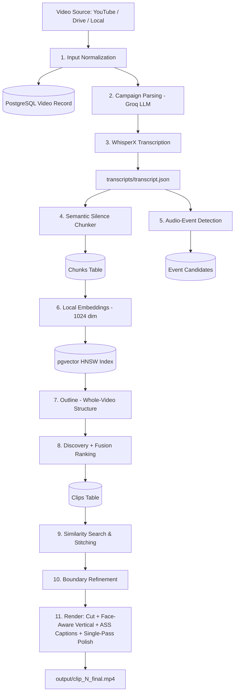

# 🎬 Viral Clips Automator

[](LICENSE)
[](https://www.python.org/)
[](https://github.com/pgvector/pgvector)
[](https://ffmpeg.org/)
[](https://console.groq.com)

**Viral Clips Automator** is an end-to-end autonomous AI pipeline that transforms long-form videos (podcasts, interviews, streams, webinars) into high-performing 9:16 vertical short-form viral clips optimized for **TikTok**, **Instagram Reels**, and **YouTube Shorts**.

Built with **Groq LLM** (`openai/gpt-oss-120b` for understanding text), **local SentenceTransformer embeddings** (`Qwen3-Embedding-0.6B`, 1024-dim, no API key), **WhisperX** (word-level transcription), **PostgreSQL + pgvector** (HNSW semantic memory), and **FFmpeg** (face-aware 9:16 framing, ASS karaoke captions, single-pass polish).

---

## 🌟 Key Features

- **🌐 Multi-Source Ingestion**: YouTube (with 360p fallback), YouTube Live (300s cap), Google Drive, direct MP4 URLs, or local files.
- **🎙️ Word-Level Accurate Transcription**: WhisperX with per-word timestamps; `device: auto` uses CUDA when available. Traceable glossary corrections.
- **🧠 Semantic & Silence-Gap Chunking**: Splits at natural pauses and sentence boundaries, never mid-thought; 25s overlap so boundary moments are never lost.
- **🔊 Audio-Event Discovery**: RMS spike detector finds laughter/applause/reactions and proposes transcript-aligned candidates (optional YAMNet labels, off by default).
- **🗺️ Whole-Video Understanding**: Two-pass contextual discovery — video outline (topics, Q&A, story arcs) → sentence-ID-cited candidates → editorial fusion ranking with quality floor and recorded reasons.
- **⚡ Local Vector Knowledge Store**: 1024-dim local embeddings in PostgreSQL + pgvector HNSW; no embedding API costs or rate limits.
- **✂️ Sentence-Complete Boundaries**: Deterministic snap + LLM validation guarantees clips never end mid-thought; rejects or repairs incomplete endings with reasons.
- **🔗 Topical Similarity & Continuation Stitching**: pgvector search + 3-way LLM classification (`stitch`/`standalone`/`noise`) with gap/total caps so distant passages are never Franken-stitched.
- **📱 Full-Screen 9:16 Crops (hard requirement)**: `auto` / `speaker_crop` / `stacked_split` / `center_crop` via MediaPipe BlazeFace tracking + per-scene crop plans. Every shot fills the frame — no letterbox, padding, or background fill. Manual 9:16 ROIs (Review tab) override detection; heuristic crops are flagged for review.
- **✨ Phrase-Level Karaoke Captions**: One-pass ASS burn with current-word highlighting and face-aware top/bottom placement (drawtext fallback).
- **📋 Versioned Edit Plans**: Every clip gets a structured, fingerprinted plan (`edit_plans` table + `clip_N_plan.json`) shared by preview and export; single-pass FFmpeg polish (loudness norm, music ducking, limiter, logo, fades — speech never faded).
- **🎨 Campaign-Aware Branding**: Natural-language campaign parsing, style templates, watermark logos, background music with ducking.
- **🔁 Checkpointed Resumption**: Every stage in PostgreSQL (fingerprint-gated); interrupted runs resume; `rerun_from_embed.py` re-runs embed→render dup-safe.
- **💻 Dual Interface + Review**: CLI or Gradio Web UI with a **Review & Correct** tab (boundary/layout/caption fixes + selective per-clip re-render).

---

## 🏗️ Architecture & Pipeline Flow



---

## 📦 Tech Stack

- **Core**: Python 3.10+, PyYAML, Requests, Subprocess
- **LLM**: Groq API (`openai/gpt-oss-120b`, OpenAI-compatible) — campaign parsing, discovery, boundary validation, similarity classification
- **Embeddings**: Local SentenceTransformer (`models/Qwen3-Embedding-0.6B`, 1024-dim) — no API key needed
- **Speech-to-Text**: WhisperX (word-level timestamps) + librosa
- **Database**: PostgreSQL 15+ with `pgvector` extension
- **Video**: FFmpeg (`libx264`, `aac`), OpenCV, MediaPipe BlazeFace
- **Web UI**: Gradio
- **Video Downloader**: `yt-dlp`, `gdown`

---

## 📋 Prerequisites

1. **Python 3.10+** (`python3 --version`)
2. **FFmpeg** with `libx264` + `aac` (and `ass` filter for one-pass captions — included in standard builds):
   ```bash
   # macOS (Homebrew)
   brew install ffmpeg
   # Ubuntu / Debian
   sudo apt update && sudo apt install -y ffmpeg
   ```
3. **PostgreSQL with pgvector**:
   ```bash
   # macOS (Homebrew)
   brew install postgresql@16 pgvector
   brew services start postgresql@16
   # Ubuntu / Debian
   sudo apt install -y postgresql-16 postgresql-16-pgvector
   sudo systemctl start postgresql
   ```
4. **Groq API keys** (LLM only — embeddings are local): free at [console.groq.com/keys](https://console.groq.com/keys). Fill all four slots (`GROQ_API_KEY`, `_2`, `_3`, `_FALLBACK`); the pipeline routes stages across keys and falls back automatically.
5. **Node.js or Deno** (for HD YouTube downloads — yt-dlp needs a JS runtime to unlock ≥720p formats; without one the pipeline refuses SD sources instead of producing blurry clips).
5. **Local embedding model**: `models/Qwen3-Embedding-0.6B` (or set `EMBED_MODEL` to a local dir / HuggingFace id; dim must match `vector(1024)` or `EMBED_DIM`).

---

## 🚀 Quickstart & Setup

### 1. Clone the Repository

```bash
git clone https://github.com/your-username/viral-clips.git
cd viral-clips
```

### 2. Create and Activate a Virtual Environment

```bash
python3 -m venv .venv
source .venv/bin/activate    # On Windows: .venv\Scripts\activate
```

### 3. Install Dependencies

```bash
pip install --upgrade pip
pip install -r requirements.txt
```

### 4. Initialize PostgreSQL Database

```bash
createdb viral_clips
psql -d viral_clips -f db/schema.sql
psql -d viral_clips -f db/migrate_embeddings_1024.sql
psql -d viral_clips -f db/migration_v4.sql
psql -d viral_clips -f db/migration_v5.sql
psql -d viral_clips -f db/migration_v6.sql
```

Verify (`\dt` should show `videos, chunks, clips, related_segments, pipeline_runs, candidates, outlines, audio_events, edit_plans, stage_fingerprints`).

### 5. Configure Environment Variables

```bash
cp .env.example .env
```

```env
# Groq LLM (embeddings are local — no key needed)
# Slots: key1 = outline/discovery, key2 = similarity, key3 = campaign/analyzer,
# key4 = automatic fallback. Empty slots are skipped.
GROQ_API_KEY=your_groq_api_key_1_here
GROQ_API_KEY_2=your_groq_api_key_2_here
GROQ_API_KEY_3=your_groq_api_key_3_here
GROQ_API_KEY_FALLBACK=your_groq_api_key_4_here
GROQ_MODEL=openai/gpt-oss-120b

# Local embeddings (must match DB vector dim)
EMBED_MODEL=models/Qwen3-Embedding-0.6B
EMBED_DIM=1024

# PostgreSQL
DB_HOST=localhost
DB_PORT=5432
DB_NAME=viral_clips
DB_USER=your_postgres_username
DB_PASSWORD=your_postgres_password
```

---

## 💻 Usage

### Option A: Launch the Web UI

```bash
python ui.py
```
Open `http://localhost:7862`. Enter a URL/path, describe the campaign, pick a template + layout, generate — then fix boundaries/layouts/captions in the **Review & Correct** tab and re-render single clips.

### Option B: Run via CLI

```bash
python main.py "https://youtu.be/XXXX" --campaign "podcast style, add logo" --template podcast_clip --layout auto
# --layout auto|speaker_crop|stacked_split|branded_fit   (default: auto)
# --no-refine   # skip boundary refinement (keep analyzer timestamps)
# --log-level DEBUG
```

### Option C: Re-run from embeddings (existing video)

Dup-safe cleanup + embed→render for a video already in the DB:

```bash
python rerun_from_embed.py <video_id>
```

---

## 📁 Repository Structure

```text
viral-clips/
├── main.py                    # Orchestrator — run_pipeline() 11 stages + render_clips()
├── ui.py                      # Gradio Web UI: Generate + Review & Correct (port 7862)
├── rerun_from_embed.py        # Dup-safe re-run helper (embed → render)
├── preview_framing.py         # Verification: layout previews → output/previews/
├── demo_faces.py              # Verification: synthetic face demos
├── bench_transcribe.py        # Verification: WhisperX benchmark → output/bench_transcription.json
├── config.py                  # Groq + embedding settings, get_config(), ffmpeg resolvers
├── config.yaml                # All tunables: chunking/similarity/outline/discovery/audio/fusion/captions/refine/framing/...
├── requirements.txt           # Python dependencies
├── .env.example               # Environment template
│
├── campaign/                  # campaign_parser.py (Groq NL→JSON) + templates/
├── db/                        # schema.sql + migrations v4–v6, connection.py, repositories/
├── input/                     # input_handler.py (YouTube/Drive/local/URL → raw_video.mp4)
│
├── pipeline/                  # transcriber, chunker, embedder, outline, discovery, analyzer,
│                              # audio_events (+classifier), fusion, similarity, boundaries,
│                              # clipper, framing (+diarization/speakers/visual), captions,
│                              # glossary, regen_srt, editplan, polish, review (+fallbacks)
│
├── assets/                    # logos/, music/
├── clips/                     # Cut clips, SRTs, edit plans (runtime)
├── downloads/                 # Extracted audio (runtime)
├── transcripts/               # transcript.json/txt, outline.json, clips_analysis.json (runtime)
└── output/                    # Final vertical clips + report.json
```

---

## ⚙️ Configuration

Key `config.yaml` sections (all tunable without code edits):

```yaml
ai: {provider: groq, llm_model: openai/gpt-oss-120b}
embeddings: {model: models/Qwen3-Embedding-0.6B, truncate_dim: 1024}
similarity: {top_k: 3, threshold: 0.5, max_stitch_gap_seconds: 45, max_total_seconds: 90}
discovery: {target_clips: 8, min_span_seconds: 15, max_span_seconds: 90}  # target = maximum
fusion: {min_score: 0.45}      # quality floor — fewer clips when quality is insufficient
refine: {enabled: true, max_extension_seconds: 15, max_duration: 90}
framing: {default_layout: auto, full_screen_vertical: true}  # every shot fills 9:16; branded_fit manual-only
captions: {renderer: ass, placement: auto}
fades: {video: true, audio: false}   # speech is never faded
export: {consolidated: true}   # false = legacy multi-pass chain
```

---

## 🧪 Tests

220/220 green (`pytest`; unit tests are fully mocked — no API/DB/FFmpeg needed). `validate_fullscreen.py` checks real renders (dims, audio, duration, static-fill scan, crop-debug previews).

---

## 🛡️ Security & Privacy

- **Never commit your `.env` file**. No secrets are hardcoded — an empty `GROQ_API_KEY` triggers mock/fallback paths.
- All secrets load strictly via environment variables.

---

## 🤝 Contributing

Contributions welcome! See [CONTRIBUTING.md](CONTRIBUTING.md) for code style, branch naming, and PR procedures.

---

## 📄 License

MIT — see [LICENSE](LICENSE). Face-tracking smoothing concepts in `pipeline/framing.py` are adapted from the MIT-licensed `NaufalRizqullah/opensource-clipping` (see attribution header in that file).
