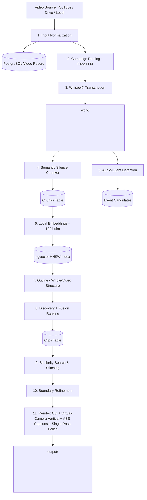

# 🎬 Viral Clips Automator

[](LICENSE)
[](https://www.python.org/)
[](https://github.com/pgvector/pgvector)
[](https://ffmpeg.org/)
[](https://console.groq.com)

**Viral Clips Automator** is an end-to-end autonomous AI pipeline that transforms long-form videos (podcasts, interviews, streams, webinars) into high-performing 9:16 vertical short-form viral clips optimized for **TikTok**, **Instagram Reels**, and **YouTube Shorts**.

Built with **Groq LLM** (`openai/gpt-oss-120b` for understanding text), **local SentenceTransformer embeddings** (`Qwen3-Embedding-0.6B`, 1024-dim, no API key), **WhisperX** (`small`, word-level transcription), **PostgreSQL + pgvector** (HNSW semantic memory), **OpenCV** (YuNet face tracking, saliency, active-speaker detection) and **FFmpeg** (virtual-camera 9:16 framing, ASS karaoke captions, single-pass polish).

Verified end-to-end on real long-form footage: a 58-minute video → 14 clips and a 27-minute video → 13 clips (64 minutes end to end on an 8 GB M-series Mac, CPU only).

It is also a **campaign tool for clipping campaigns**: give it a campaign brief + assets, then either a long video to cut into clips or a batch of short videos to modify (replace audio, logo, captions, text, reframe, intro/outro, variants…). Every output is QA-checked and delivered as a zip with posting text — see **Usage → Option A / C** and `CAMPAIGN_PIPELINE_PLAN.md`.

---

## 🌟 Key Features

- **📋 Campaign pipeline**: brief → validated, versioned edit recipe (LLM + guards, questions instead of guesses) → jobs that route each input to clip or edit mode → one compositor (audio replace / ducked music, logo, captions, text, watermark, colour, speed, intro/outro/end card, per-platform presets, variants) → per-file QA → manifest, posting text, zip.

- **🌐 Multi-Source Ingestion**: YouTube (H.264 ≤1080p preferred, HD enforced — SD is refused, audio-403 retry), YouTube Live (300s cap), Google Drive, direct URLs, or local files (used in place). Downloads are cached and reused.
- **🎙️ Word-Level Accurate Transcription**: WhisperX `small` (int8 on CPU, fp16 on CUDA) with per-word timestamps. Traceable glossary corrections.
- **🧠 Semantic & Silence-Gap Chunking**: Splits at natural pauses and sentence boundaries, never mid-thought; 25s overlap so boundary moments are never lost.
- **🔊 Audio-Event Discovery**: RMS spike detector finds laughter/applause/reactions and proposes transcript-aligned candidates (optional YAMNet labels, off by default).
- **🗺️ Whole-Video Understanding**: Two-pass contextual discovery — video outline (topics, Q&A, story arcs) → sentence-ID-cited candidates → editorial fusion ranking with quality floor and recorded reasons.
- **⚡ Local Vector Knowledge Store**: 1024-dim local embeddings in PostgreSQL + pgvector HNSW; no embedding API costs or rate limits.
- **✂️ Complete Stories**: Deterministic sentence snap + LLM validation of the *selected* ending; if the payoff comes later, a second pass extends the clip up to 30s to where it lands; clips that never resolve are dropped with a reason.
- **🔗 Topical Similarity & Continuation Stitching**: pgvector search + 3-way LLM classification (`stitch`/`standalone`/`noise`) with gap/total caps so distant passages are never Franken-stitched.
- **🎥 OpusClip-Style Framing (every shot fills 9:16, never bars)**:
  - YuNet face detection + persistent tracking, adjacent-frame scene-cut detection that ignores whip pans.
  - **Virtual camera** planned offline per scene: locked shots while the subject stays put, eased zero-phase moves, pan-speed cap, sub-pixel crops.
  - **Active-speaker director**: lip motion gated by audio picks who is talking; hard cuts on speaker change (snapped to pauses), minimum shot length, split-screen two-shot when two people talk over each other.
  - **Face-sized close-ups** (auto-zoom), subtle emphasis punch-ins on loud moments.
  - **Crowd shots** frame the group / central action; **faceless b-roll** follows motion-weighted saliency; crops avoid slicing faces.
  - `--debug-framing` side-by-side review videos; `tools/framing_audit.py` measures framing quality. Manual 9:16 ROIs (Review tab) override everything.
- **✨ Phrase-Level Karaoke Captions**: One-pass ASS burn with current-word highlighting and face-aware top/bottom placement (drawtext fallback).
- **📋 Versioned Edit Plans**: Every clip gets a structured, fingerprinted plan (`edit_plans` table + `clip_N_plan.json`) shared by preview and export; single-pass FFmpeg polish (loudness norm, music ducking, limiter, logo, fades — speech never faded).
- **🎨 Campaign-Aware Branding**: Natural-language campaign parsing, style templates, watermark logos, background music with ducking.
- **🔁 Per-Video Workspaces + Resume**: each video gets its own `work/` and `output/` folders; the same link resumes (finished stages skipped, download reused); `--fresh` and `--from-stage` for re-runs; one log file per run.
- **⏳ Free-Tier Friendly LLM Client**: 4-key rotation, waits out per-minute rate limits, strict JSON mode, reasoning-token headroom.
- **💻 Dual Interface + Review**: CLI or Gradio Web UI with a **Review & Correct** tab (boundary/layout/caption fixes + selective per-clip re-render).

---

## 🏗️ Architecture & Pipeline Flow



---

## 📦 Tech Stack

- **Core**: Python 3.10+, PyYAML, Requests, Subprocess
- **LLM**: Groq API (`openai/gpt-oss-120b`, OpenAI-compatible) — campaign parsing, discovery, boundary validation, similarity classification
- **Embeddings**: Local SentenceTransformer (`models/Qwen3-Embedding-0.6B`, 1024-dim) — no API key needed
- **Speech-to-Text**: WhisperX `small` (word-level timestamps) + librosa
- **Database**: PostgreSQL 15+ with `pgvector` extension (Docker `pgvector/pgvector:pg16` recommended)
- **Video**: FFmpeg (`libx264`, `aac`), OpenCV (YuNet face detector, spectral-residual saliency), MediaPipe / Haar fallbacks
- **Web UI**: Gradio
- **Video Downloader**: `yt-dlp`, `gdown`

---

## 📋 Prerequisites

1. **Python 3.10+** (`python3 --version`)
2. **FFmpeg** with `libx264` + `aac` (and `ass` filter for one-pass captions — included in standard builds):
   ```bash
   # macOS (Homebrew)
   brew install ffmpeg
   # Ubuntu / Debian
   sudo apt update && sudo apt install -y ffmpeg
   ```
3. **PostgreSQL with pgvector** — easiest via Docker (see step 4 below), or natively:
   ```bash
   # macOS (Homebrew)
   brew install postgresql@16 pgvector
   brew services start postgresql@16
   # Ubuntu / Debian
   sudo apt install -y postgresql-16 postgresql-16-pgvector
   sudo systemctl start postgresql
   ```
4. **Groq API keys** (LLM only — embeddings are local): free at [console.groq.com/keys](https://console.groq.com/keys). Fill all four slots (`GROQ_API_KEY`, `_2`, `_3`, `_FALLBACK`); the pipeline routes stages across keys and falls back automatically.
5. **Node.js or Deno** (for HD YouTube downloads — yt-dlp needs a JS runtime to unlock ≥720p formats; without one the pipeline refuses SD sources instead of producing blurry clips).
5. **Local embedding model**: `models/Qwen3-Embedding-0.6B` (or set `EMBED_MODEL` to a local dir / HuggingFace id; dim must match `vector(1024)` or `EMBED_DIM`).

---

## 🚀 Quickstart & Setup

### 1. Clone the Repository

```bash
git clone https://github.com/your-username/viral-clips.git
cd viral-clips
```

### 2. Create and Activate a Virtual Environment

```bash
python3 -m venv .venv
source .venv/bin/activate    # On Windows: .venv\Scripts\activate
```

### 3. Install Dependencies

```bash
pip install --upgrade pip
pip install -r requirements.txt
```

### 4. Initialize PostgreSQL Database

Easiest: Docker with pgvector (port 5433 so it never clashes with a local Postgres):

```bash
docker run -d --name viral-clips-db -e POSTGRES_USER=postgres -e POSTGRES_PASSWORD=postgres \
  -e POSTGRES_DB=viral_clips -p 5433:5432 -v viral_clips_pgdata:/var/lib/postgresql/data \
  --restart unless-stopped pgvector/pgvector:pg16
db/init_db.sh --docker viral-clips-db      # extension + schema + migrations v4-v6 (idempotent)
```

Or an existing Postgres with pgvector: `createdb viral_clips && DB_PORT=5432 db/init_db.sh`.

Verify (`\dt` should show `videos, chunks, clips, related_segments, pipeline_runs, candidates, outlines, audio_events, edit_plans, stage_fingerprints`).

### 5. Configure Environment Variables

```bash
cp .env.example .env
```

```env
# Groq LLM (embeddings are local — no key needed)
# Slots: key1 = outline/discovery, key2 = similarity, key3 = campaign/analyzer,
# key4 = automatic fallback. Empty slots are skipped.
GROQ_API_KEY=your_groq_api_key_1_here
GROQ_API_KEY_2=your_groq_api_key_2_here
GROQ_API_KEY_3=your_groq_api_key_3_here
GROQ_API_KEY_FALLBACK=your_groq_api_key_4_here
GROQ_MODEL=openai/gpt-oss-120b

# Local embeddings (must match DB vector dim)
EMBED_MODEL=models/Qwen3-Embedding-0.6B
EMBED_DIM=1024

# PostgreSQL (Docker setup from step 4)
DB_HOST=localhost
DB_PORT=5433
DB_NAME=viral_clips
DB_USER=postgres
DB_PASSWORD=postgres
```

---

## 💻 Usage

### Option A: Launch the Web UI

```bash
python ui.py
```
Open `http://localhost:7862`. The UI is campaign-first:

1. **Campaigns** — create a campaign, paste the client's brief, upload its assets (logos, audio, fonts, intro/outro videos, images), **Parse brief** → the edit recipe in plain English + any questions, edit the JSON if needed, **Save recipe**.
2. **New job** — pick the campaign, paste links / file paths / folders or upload videos, **Check inputs** (duration, aspect, auto mode: long videos are cut into clips, short ones edited; override per input), **Run job**.
3. **Jobs** — live progress, per-input errors, cancel, resume / retry failed inputs.
4. **Review & deliver** — every deliverable with its compliance checklist (duration, size, codecs, loudness, audio replaced, logo present, text drawn), posting text, approve / reject, re-render one file with a tweaked recipe, download a zip (+ `manifest.json`, `posting.txt`).
5. **Quick clips** — the original one-off generator (URL + campaign text → clips).
6. **Clip review** — fix boundaries / layouts / captions of a clipped video and re-render single clips.

### Option B: Run via CLI

```bash
python main.py "https://youtu.be/XXXX" --campaign "podcast style, add logo" --template podcast_clip --layout auto
# --layout auto|speaker_crop|stacked_split|center_crop   (default: auto)
# --no-refine          skip boundary refinement (keep analyzer timestamps)
# --debug-framing      also write side-by-side framing review videos
# --fresh              start over even if this source was processed before
# --from-stage STAGE   redo STAGE and everything after it (transcribe, chunk, audio_events,
#                      embed, outline, analyze, similarity, refine, render)
# --log-level DEBUG
```

Running the same link again **resumes** that video: finished stages are skipped and the
download is reused. Where things go:

```
downloads/<youtube-id>.mp4              cached source video
work/<source>_<id8>/                    audio, transcript, outline, clips/ (SRT, edit plans, debug videos)
output/<source>_<id8>/clip_N_final.mp4  finished clips + report.json
logs/runs/<timestamp>_<source>.log      one log file per run
```

### Option C: Campaign jobs from the CLI

```bash
python main.py campaign create --name "Acme Summer" --asset logo.png --asset track.mp3 \
    --brief "Replace the audio with the summer track, logo top right, captions, 'Link in bio' for the last 3 seconds, TikTok + Reels, under 60 seconds"
python main.py campaign list | show <slug> | brief <slug> [--brief "…"]
python main.py job run --campaign acme-summer --input https://youtu.be/… --input clips_folder/ [--mode auto|clip|edit]
python main.py job status [<job>]        # job resume <job> re-runs unfinished inputs
```

Deliverables land in `output/campaigns/<campaign>/<job8>/` (one file per input × clip × variant × platform). Recipe ops: trim, reframe, audio replace / add music (ducked) / mute / volume, logo, captions, text overlays (hook / CTA / handle / disclaimer), watermark, intro, outro, end card, speed, colour, plus **variants** (e.g. two hooks). See `CAMPAIGN_PIPELINE_PLAN.md`.

### Option D: Re-run an existing video from a stage

```bash
python rerun_from_embed.py <video_id> --from-stage refine   # default: audio_events
```

---

## 📁 Repository Structure

```text
viral-clips/
├── main.py                    # Orchestrator — run_pipeline() (11 stages, resume) + render_clips()
├── ui.py                      # Gradio Web UI (port 7862): 4 campaign tabs + Quick clips + Clip review
├── campaign_ui.py             # Campaign tabs: Campaigns, New job, Jobs, Review & deliver
├── rerun_from_embed.py        # Re-run an existing video from a stage
├── topup_clips.py / validate_fullscreen.py / preview_framing.py   # maintenance & verification
├── tools/framing_audit.py     # Measure framing quality of a rendered video
├── config.py / config.yaml    # Settings (config.yaml is the source of truth)
├── requirements.txt / .env.example
├── AGENT_CONTEXT.md           # Full technical documentation
├── OPEN_ISSUES.md             # Known open problems, prioritised
├── CAMPAIGN_PIPELINE_PLAN.md  # Campaign pipeline design + C1–C8 progress log
│
├── campaign/                  # service (campaigns + assets), recipe + presets, brief_parser,
│                              # edit_mode, clip_mode, jobs (router/worker), qa, delivery, cli;
│                              # legacy campaign_parser.py + templates/
├── db/                        # schema + migrations v4–v7, init_db.sh, connection.py, repositories/
├── input/                     # input_handler.py (YouTube/Drive/local/URL → cached local file)
├── pipeline/                  # transcriber, chunker, embedder, audio_events, outline, discovery,
│                              # analyzer, fusion, similarity, boundaries, clipper, framing,
│                              # active_speaker, captions, editplan, polish, review, workspace,
│                              # compositor (campaign recipe renderer), media (probe),
│                              # llm_client (+ optional speakers/diarization/visual, legacy fallbacks)
├── assets/                    # logos/, music/, campaigns/<slug>/<kind>/ (campaign asset libraries)
├── models/                    # local embedding + face models
│
├── downloads/                 # cached source videos (runtime)
├── work/<video>/              # audio, transcript, outline, clips/ intermediates + debug videos (runtime)
├── output/<video>/            # final vertical clips + report.json (runtime)
├── output/campaigns/<slug>/<job8>/   # campaign deliverables + manifest.json + posting.txt + zip
├── work/campaigns/            # per-job intermediates (runtime)
└── logs/                      # rotating log + logs/runs/ one file per run (runtime)
```

---

## ⚙️ Configuration

Key `config.yaml` sections (all tunable without code edits):

```yaml
ai: {provider: groq, llm_model: openai/gpt-oss-120b}
embeddings: {model: models/Qwen3-Embedding-0.6B, truncate_dim: 1024}
similarity: {top_k: 3, threshold: 0.5, max_stitch_gap_seconds: 45, max_total_seconds: 90}
discovery: {target_clips: 15, min_span_seconds: 15, max_span_seconds: 90}  # target = maximum
fusion: {min_score: 0.45}      # quality floor — fewer clips when quality is insufficient
transcription: {model: small, compute_type: auto}   # int8 on CPU, fp16 on CUDA
refine: {max_extension_seconds: 15, max_duration: 90,
         max_payoff_extension_seconds: 30, reject_incomplete: true}
framing: {default_layout: auto, full_screen_vertical: true,   # every shot fills 9:16
          active_speaker: true, auto_zoom: true, emphasis_zoom: 0.06,
          path_smooth_seconds: 0.45, deadzone_ratio: 0.15,    # calmer / livelier camera
          speaker_switch_cost: 3.0, min_shot_seconds: 1.6,    # fewer / more speaker cuts
          saliency_fallback: true, debug_video: false}
export: {consolidated: true, keep_intermediates: false}
runtime: {keep_awake: true}    # macOS: no sleep during runs
captions: {renderer: ass, placement: auto}
fades: {video: true, audio: false}   # speech is never faded
```

---

## 🗺️ Roadmap

Next: a campaign-first workflow — campaign brief + assets → clip a long video **or** apply the campaign's edits (audio, logo, text, captions, reframe) to supplied short videos, with compliance checks. See [CAMPAIGN_PIPELINE_PLAN.md](CAMPAIGN_PIPELINE_PLAN.md).

## 🐞 Known Issues

See [OPEN_ISSUES.md](OPEN_ISSUES.md). To measure framing quality on a rendered video: `python tools/framing_audit.py <video_id>`.

## 🧪 Tests

403 green (`.venv/bin/python -m pytest -q`, ~3.5 min — the campaign tests render real video with ffmpeg). LLM/network calls are mocked; the repository round-trip tests need the database running. `validate_fullscreen.py <video_id>` checks real renders (dims, audio, duration, fill scan, crop-debug previews); `tools/framing_audit.py <video_id>` measures framing quality.

## ⏱️ Performance (8 GB M-series Mac, CPU only)

27-minute 1080p video → 13 clips in ~64 minutes: download ~1 min, transcription ~4.5 min (`small`), LLM stages ~5 min (free-tier Groq, waits included), rendering ~50 min (13 clips, face framing + debug video). Rendering is the slow part; see OPEN_ISSUES §4.

---

## 🛡️ Security & Privacy

- **Never commit your `.env` file**. No secrets are hardcoded — an empty `GROQ_API_KEY` triggers mock/fallback paths.
- All secrets load strictly via environment variables.

---

## 🤝 Contributing

Contributions welcome! See [CONTRIBUTING.md](CONTRIBUTING.md) for code style, branch naming, and PR procedures.

---

## 📄 License

MIT — see [LICENSE](LICENSE). Face-tracking smoothing concepts in `pipeline/framing.py` are adapted from the MIT-licensed `NaufalRizqullah/opensource-clipping` (see attribution header in that file).
