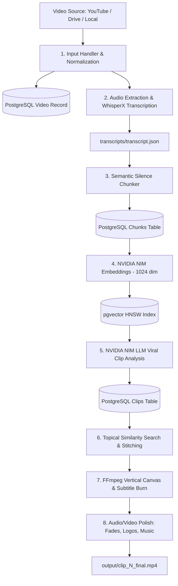

# 🎬 Viral Clips Automator

[](LICENSE)
[](https://www.python.org/)
[](https://github.com/pgvector/pgvector)
[](https://ffmpeg.org/)
[](https://build.nvidia.com)

**Viral Clips Automator** is an end-to-end autonomous AI pipeline that transforms long-form videos (podcasts, interviews, streams, webinars) into high-performing 9:16 vertical short-form viral clips optimized for **TikTok**, **Instagram Reels**, and **YouTube Shorts**.

Built with **NVIDIA NIM** (LLM analysis & vector embeddings), **WhisperX** (word-level transcription), **PostgreSQL + pgvector** (HNSW semantic memory), and **FFmpeg** (dynamic 9:16 vertical framing, blurred backdrop, and word-level karaoke subtitles).

---

## 🌟 Key Features

- **🌐 Multi-Source Ingestion**: Ingests video from YouTube, YouTube Live streams, Google Drive, direct MP4 URLs, or local files.
- **🎙️ Word-Level Accurate Transcription**: Powered by WhisperX with precise word timestamps to enable exact cut points and synchronized subtitles.
- **🧠 Semantic & Silence-Gap Chunking**: Splits audio at natural pauses and silence boundaries rather than arbitrary time intervals, preserving complete thoughts and narrative flow.
- **⚡ Vector-Embedded Knowledge Store**: Uses NVIDIA `nv-embedqa-e5-v5` (1024-dimensional embeddings) stored in PostgreSQL with pgvector HNSW indexing.
- **🎯 AI Viral Hook & Segment Analyzer**: Uses `moonshotai/kimi-k2.6` (via NVIDIA NIM) to identify high-retention hooks, compelling arguments, and viral segments.
- **🔗 Topical Similarity & Continuation Stitching**: Finds related points separated across the video and stitches them seamlessly into complete, cohesive short stories.
- **📱 9:16 Vertical Video Engine**: Converts 16:9 widescreen video into 9:16 vertical format with an aesthetically pleasing blurred background and foreground centering.
- **✨ Synchronized Word-by-Word Karaoke Subtitles**: Burns stylish, high-retention subtitles into the video with real-time word highlighting.
- **🎨 Campaign-Aware Branding**: Customize style templates (e.g. podcast, motivational reel, reaction), apply watermark logos, and mix background music with audio ducking.
- **🔁 Checkpointed Resumption**: Every stage is logged in PostgreSQL; interrupted runs can be resumed without re-downloading or re-transcribing.
- **💻 Dual Interface**: Run headless via the Command Line Interface (CLI) or launch an interactive Gradio Web UI.

---

## 🏗️ Architecture & Pipeline Flow



---

## 📦 Tech Stack

- **Core**: Python 3.10+, PyYAML, Requests, Subprocess
- **AI & NLP**: NVIDIA NIM API (`moonshotai/kimi-k2.6` for LLM, `nvidia/nv-embedqa-e5-v5` for Embeddings)
- **Speech-to-Text**: WhisperX / OpenAI Whisper (Word-level timestamps)
- **Database**: PostgreSQL 15+ with `pgvector` extension
- **Video & Audio Processing**: FFmpeg (`libx264`, `aac`, complex filters)
- **Web UI**: Gradio
- **Video Downloader**: `yt-dlp`, `gdown`

---

## 📋 Prerequisites

Before installing, ensure your environment has:

1. **Python 3.10+**:
   ```bash
   python3 --version
   ```
2. **FFmpeg** (with `libx264` and `aac` support):
   ```bash
   # macOS (Homebrew)
   brew install ffmpeg

   # Ubuntu / Debian
   sudo apt update && sudo apt install -y ffmpeg
   ```
3. **PostgreSQL with pgvector**:
   ```bash
   # macOS (Homebrew)
   brew install postgresql@16 pgvector
   brew services start postgresql@16

   # Ubuntu / Debian
   sudo apt install -y postgresql-16 postgresql-16-pgvector
   sudo systemctl start postgresql
   ```
4. **NVIDIA NIM API Key**:
   Create a free account at [build.nvidia.com](https://build.nvidia.com) to obtain your API key.

---

## 🚀 Quickstart & Setup

### 1. Clone the Repository

```bash
git clone https://github.com/your-username/viral-clips.git
cd viral-clips
```

### 2. Create and Activate a Virtual Environment

```bash
python3 -m venv .venv
source .venv/bin/activate    # On Windows: .venv\Scripts\activate
```

### 3. Install Dependencies

```bash
pip install --upgrade pip
pip install -r requirements.txt
```

### 4. Initialize PostgreSQL Database

Create the database and apply the database schema:

```bash
createdb viral_clips
psql -d viral_clips -f db/schema.sql
```

Verify that the `vector` extension and tables are created:
```bash
psql -d viral_clips -c "\dt"
```

### 5. Configure Environment Variables

Copy the example environment template:

```bash
cp .env.example .env
```

Open `.env` and fill in your details:
```env
# NVIDIA NIM API Credentials
NVIDIA_API_KEY=nvapi-your-key-here

# PostgreSQL Database Configuration
DB_HOST=localhost
DB_PORT=5432
DB_NAME=viral_clips
DB_USER=your_postgres_username
DB_PASSWORD=your_postgres_password
```

---

## 💻 Usage

### Option A: Launch the Web UI

Run the interactive Gradio web application:

```bash
python ui.py
```
Open your browser at `http://localhost:7862`. Paste a YouTube URL or upload a video file, select your campaign style, and generate clips with real-time visual progress.

### Option B: Run via CLI

Run the full end-to-end pipeline from the terminal:

```bash
python main.py
```
By default, this will prompt for or run the configured input video, extract clips, burn karaoke subtitles, and output finished vertical MP4 files in the `output/` directory.

### Option C: Resume an Interrupted Pipeline

If a stage was interrupted or you want to restart from analysis:

```bash
python resume.py
```

---

## 📁 Repository Structure

```text
viral-clips/
├── main.py                    # Pipeline orchestrator — runs all 8 stages
├── ui.py                      # Interactive Gradio Web UI (port 7862)
├── resume.py                  # Checkpoint resumption helper
├── config.py                  # Configuration loader (config.yaml + .env)
├── config.yaml                # Default settings for FFmpeg, chunking & AI
├── requirements.txt           # Python package dependencies
├── .env.example               # Environment variables template
├── .gitignore                 # Excludes caches, venvs, and generated media
│
├── campaign/                  # Natural language campaign parsing & templates
│   ├── campaign_parser.py     # Maps user instructions to campaign settings
│   └── templates/             # Preset configs (podcast, reaction, etc.)
│
├── db/                        # Database layer (PostgreSQL + pgvector)
│   ├── schema.sql             # SQL schema definitions & HNSW indexes
│   ├── connection.py          # Threaded connection pool
│   └── repositories/          # Data access objects (video, chunk, clip, run)
│
├── input/                     # Video ingestion logic
│   └── input_handler.py       # Supports YouTube, Drive, direct URLs, local files
│
├── pipeline/                  # Core video & AI processing modules
│   ├── transcriber.py         # WhisperX transcription engine
│   ├── chunker.py             # Semantic & silence boundary chunker
│   ├── embedder.py            # NVIDIA NIM vector embeddings
│   ├── analyzer.py            # NVIDIA NIM viral clip hook analyzer
│   ├── similarity.py          # Vector search & continuation classification
│   ├── clipper.py             # FFmpeg cut and stitch engine
│   ├── regen_srt.py           # Per-clip synchronized SRT generation
│   ├── fast_burn.py           # Word-level karaoke drawtext subtitle burner
│   └── improvements.py        # Video fades, branding logos, and audio ducking
│
├── assets/                    # Static assets
│   ├── logos/                 # Branding watermarks
│   └── music/                 # Optional background tracks
│
├── clips/                     # Temporary cut clips & subtitles (runtime)
├── downloads/                 # Intermediate extracted audio files (runtime)
├── transcripts/               # Generated transcripts & analysis JSON (runtime)
└── output/                    # Final rendered vertical clips (clip_N_final.mp4)
```

---

## ⚙️ Configuration

System parameters can be adjusted in [`config.yaml`](config.yaml):

```yaml
ffmpeg:
  path: "ffmpeg"               # System ffmpeg or custom path
  encoder: "libx264"
  preset: "fast"
  crf: 23

defaults:
  min_clip_duration: 45        # Minimum clip length in seconds
  aspect_ratio: "9:16"         # Target format for TikTok/Reels/Shorts
  music_volume: 0.3
  fade_duration: 0.5

chunking:
  silence_threshold_seconds: 1.2
  max_tokens_per_chunk: 1000
  overlap_seconds: 25

similarity:
  top_k: 3
  threshold: 0.65
  llm_confirmation: true
```

---

## 🛡️ Security & Privacy

- **Never commit your `.env` file**. The `.gitignore` is preconfigured to prevent credentials from being committed to Git.
- All secrets and API keys are loaded strictly via environment variables.

---

## 🤝 Contributing

Contributions are welcome! Please check out [CONTRIBUTING.md](CONTRIBUTING.md) for guidelines on code style, branch naming, and pull request procedures.

---

## 📄 License

This project is licensed under the [MIT License](LICENSE).
